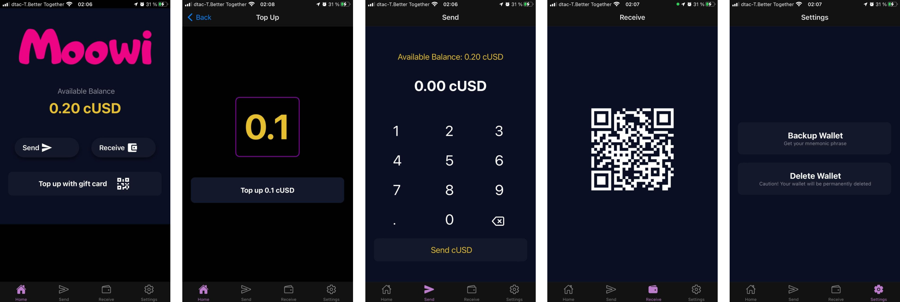
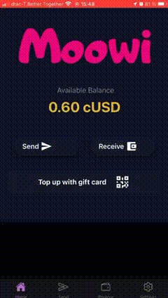

# Moowi

Moowi is a mobile wallet that can be topped up with gift cards.

You can get a gift card, scan it, and voilà: you just received crypto in your wallet.

## Quickstart

1. Download [Expo Go](https://expo.dev/client) to your phone.
2. Head over to our [Demo Card Site](https://moowi-card.bakoush.in/) on any other device.
3. Scan the QR code with your phone to download Moowi app for Expo Go.
4. Create a new wallet in the Moowi app.
5. Scan a secret code within the app to top up your wallet.

## What's inside

### App

Mobile wallet which can be topped up with gift cards.

### Contract

Celo smart contract for redeeming gift cards.

Deployed on Celo Alfajores Testnet: [0xCF54C73e26Fdd637E63c0E354CD63f7305b4c128](https://alfajores-blockscout.celo-testnet.org/address/0xCF54C73e26Fdd637E63c0E354CD63f7305b4c128/transactions).

### Demo Card

Website producing demo cards for Moowi top-up.

Live: https://moowi-card.bakoush.in

### Lambda

AWS Lambda functions to connect the App and the Smart Contract.
